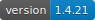
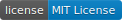

# bank_scrapers

<!-- START doctoc generated TOC please keep comment here to allow auto update -->
<!-- DON'T EDIT THIS SECTION, INSTEAD RE-RUN doctoc TO UPDATE -->

- [Quick Start](#quick-start)
- [Introduction](#introduction)
- [Getting Started](#getting-started)
    - [Installation](#installation)
    - [Usage](#usage)
- [Drivers](#drivers)
    - [BECU](#becu)
    - [Chase](#chase)
    - [Fidelity NetBenefits](#fidelity-netbenefits)
    - [RoundPoint](#roundpoint)
    - [SMBC Prestia](#smbc-prestia)
    - [UHFCU](#uhfcu)
    - [Vanguard](#vanguard)
    - [Zillow](#zillow)
- [API Wrappers](#api-wrappers)
    - [Kraken](#kraken)
- [Crypto](#crypto)
    - [Bitcoin (BTC)](#bitcoin-btc)
    - [Ethereum (ETH)](#ethereum-eth)
- [Disclaimer](#disclaimer)

<!-- END doctoc generated TOC please keep comment here to allow auto update -->

# Quick Start

```shell
pip install bank_scrapers
```

```shell
bank-scrape {subcommand} $LOGIN_USER $LOGIN_PASS
```

# Introduction

`bank_scrapers` is a library containing drivers for scraping account information from various financial websites.

Since most traditional financial institutions don't provide an API for accessing one's account data, most of these
drivers utilize `Playwright` to impersonate the user using the provided credentials.

# Getting Started

## Installation

### Requirements

#### Chrome

Unfortunately, undetected-playwright will only start consistently while using Chrome. Here's how to install:

```shell
wget -q -O - https://dl-ssl.google.com/linux/linux_signing_key.pub | apt-key add - && \
sh -c 'echo "deb [arch=amd64] http://dl.google.com/linux/chrome/deb/ stable main" >> /etc/apt/sources.list.d/google.list' && \
sudo apt update && \
sudo apt install -y google-chrome-stable
```

####  xvfb

Since these modules are ran in virtual displays to avoid detection, the `xvfb` package is required.

```shell
sudo apt update && sudo apt install -y xvfb xserver-xephyr tigervnc-standalone-server
```

### `stable`

```shell
pip install bank_scrapers
```

### `experimental`

```shell
pip install git+https://github.com/eebette/bank_scrapers.git
```

## Usage

> 💡 Usage examples for each driver are listed in that driver's documentation

### CLI

#### For general info and complete usage documentation

```shell
bank-scrape -h
```

#### General usage pattern

```shell
bank-scrape {subcommand} $LOGIN_USER $LOGIN_PASS
```

### API

API results are returned as a Python list of pandas dataframes, containing relevant data scraped from the site. See each
driver's section for info on what is in that driver's return tables.

```python
import asyncio
from bank_scrapers.scrapers.becu.driver import get_accounts_info

tables = asyncio.run(get_accounts_info(username="{username}", password="{password}"))
for t in tables:
    print(t.to_string())

```

#### `get_accounts_info()` for general use

As of version 1.1, there is a single `get_accounts_info()` function available in the module
`bank_scrapers.get_accounts_info` that takes the institution name as the first argument and the rest of the
institution's required arguments after that.

**Example**

```python
import asyncio
from bank_scrapers.get_accounts_info import get_accounts_info

accounts_info = asyncio.run(get_accounts_info("chase", "{username}", "{password}"))

for table in accounts_info:
    print(table)

```

#### Prometheus-friendly Exposition Format

As of version 1.1, it is possible to get output the metrics in the form of `[labels] metric` by passing the
`prometheus=True` parameter to `get_accounts_info`.

Passing this parameter will cause the API to return the following format: `Tuple(List, List)`

1. The first list in the tuple will return a list of labels (one per symbol per account) and their **Quantity** (i.e.
   number of shares/units).
2. The second list in the tuple will return a list of labels (one per symbol per account) and the symbol's **USD value**
   (i.e. #.# if it's a US-based bank account, such as Chase, or the share value of a stock, such as in Vanguard
   accounts).

The metric comes back in the following format:

```
(['<institution_name>', <account_number>, '<account_type>', '<symbol>'], <metric>)
```

**Example**

This functionality is meant to make these metrics easily ingest-able into a Prometheus server.

```python
import asyncio
from bank_scrapers.scrapers.vanguard.driver import get_accounts_info

prometheus_output = asyncio.run(
    get_accounts_info("{username}", "{password}", prometheus=True)
)

print((prometheus_output[0][0], prometheus_output[1][0]))

```

```
> ((['Vanguard', ########, 'deposit', 'TTWO'], ##.#), (['Vanguard', ########, 'deposit', 'TTWO'], ###.##))
```

```python
LABELS = [
    "institution",
    "account",
    "account_type",
    "symbol",
]

metrics = Gauge(
    name,
    documentation,
    LABELS,
    registry=registry,
)

for metric in prometheus_output[0]:
    labels: List[str] = metric[0]
    value: float = metric[1]
    metrics.labels(*labels).set(value)

```

### General

#### MFA Automation

As of version 1.1, it is possible to automate the Multi-Factor Authentication workflows in both the API and the CLI by
providing a Python dict (or JSON file in the case of the CLI) with the following:

1. `otp_contact_option`: The list option which you would like to use for MFA Authentication (e.g. when a site asks if
   you'd like to be
   contacted via **1** Phone or **2** SMS)
2. `otp_code_location`: The file directory location to look for a file containing the One-Time Password (OTP).
   See `OTP File Requirements`
   below

**Example**

```python
from bank_scrapers.scrapers.roundpoint.driver import get_accounts_info

prometheus_output = get_accounts_info(
    "{username}",
    "{password}",
    mfa_auth={"otp_contact_option": 1, "otp_code_location": "/tmp/otp_codes"},
)

```

or

```bash
bank-scrape roundpoint $LOGIN_USER $LOGIN_PASS --json_file ~/roundpoint_mfa.json
```

##### OTP File Requirements

* The scraper will begin searching the text in files in the `otp_code_location` ## seconds after the OTP request is
  submitted on the site.
* The scraper will look at each file in the `otp_code_location` in reverse alphabetical order. For this reason, if you
  are automatically moving your SMS to this folder through some automation system, it is recommended to prepend the file
  names with a timestamp.
* Each scraper has a string term that it searches for in each file (to ensure that the OTP was sent from/belongs to the
  correct institution). These values for can be found in each scraper's documentation below.
* The scraper will NOT delete the file once it is done. Maintaining this directory is up to you.

> Automating getting SMS messages with OTP codes from your phone to .txt files on your PC is outside the scope of
> this project, [SMS to URL Forwarder](https://f-droid.org/packages/tech.bogomolov.incomingsmsgateway/) and
> [webhook](https://github.com/adnanh/webhook) is a good place to start.

# Drivers

These are all written in Python using the Playwright driver and, for the most part, try to simulate the real user
experience/workflow as seen in the eyes of the website provider.

## BECU


[Boeing Enterprises Credit Union](https://www.becu.org/)

### About

This is a Playwright driver that logs in using provided credentials and reads account info from the landing page.

> ❗️Driver does NOT currently support MFA

### Example Usage

#### CLI

```shell
bank-scrape becu $LOGIN_USER $LOGIN_PASS
```

#### API

```python
import asyncio
from bank_scrapers.scrapers.becu.driver import get_accounts_info

tables = asyncio.run(get_accounts_info(username="{username}", password="{password}"))
for t in tables:
    print(t.to_markdown(index=False))

```

#### Example Result

|    Account | YTD Interest | Current Balance | Available Balance | account_type | symbol | usd_value |
|-----------:|-------------:|----------------:|------------------:|:-------------|:-------|----------:|
| ########## |       ###.## |        #####.## |          #####.## | deposit      | USD    |         1 |
| ########## |       ###.## |        #####.## |          #####.## | deposit      | USD    |         1 |
| ########## |       ###.## |        #####.## |          #####.## | deposit      | USD    |         1 |

| Account | Current Balance | Available Credit | account_type | symbol | usd_value |
|--------:|----------------:|-----------------:|:-------------|:-------|----------:|
|    #### |         ####.## |            ##### | credit       | USD    |         1 |

## Chase


[Chase Banking](https://www.chase.com/)

### About

This is a Playwright driver that logs in using provided credentials, navigates MFA, navigates to the detail account info
from the landing page, and reads the account info from the page.

> ✔️ Driver supports handling of MFA

> ❗️This driver is designed to crawl and pull data for Chase credit card services **only**. Chase shared bank accounts
> are currently not in the scope of this project

### Example Usage

#### CLI

```shell
bank-scrape chase $LOGIN_USER $LOGIN_PASS
```

#### API

```python
import asyncio
from bank_scrapers.scrapers.chase.driver import get_accounts_info

tables = asyncio.run(get_accounts_info(username="{username}", password="{password}"))
for t in tables:
    print(t.to_markdown(index=False))

```

#### MFA

##### Example Workflow

```console
>>> # Example MFA workflow
>>> tables = get_accounts_info(username="{username}", password="{password}")
1: Get a text
2: Get a call
Please select one: {user_choose_mfa_option}
Enter OTP Code: {user_enters_otp_code}
```

##### Example Automation JSON

Note that Chase has 2 MFA workflows. `otp_contact_option` refers to the (now) more common one with a binary Call Me/Text
Me choice. `otp_contact_option_alternate` refers to the traditional workflow with a list of numbers and contact options
in a dropdown list.

```json
{
  "otp_contact_option": 2,
  "otp_contact_option_alternate": 2,
  "otp_code_location": "/tmp/otp_codes"
}
```

##### OTP Code File Keyword

`Chase`

#### Example Result

| Current balance | Pending charges | Available credit | Total credit limit | Next closing date | Balance on last statement | Remaining statement balance | Payments are due on the | account | account_type | symbol | usd_value |
|----------------:|----------------:|-----------------:|-------------------:|------------------:|--------------------------:|----------------------------:|------------------------:|--------:|:-------------|:-------|----------:|
|         ####.## |           ##.## |          #####.# |              ##### |             ##### |                   ####.## |                     ####.## |                       # |    #### | credit       | USD    |         1 |

| Last payment | Minimum payment | Automatic Payments | account | account_type | symbol |
|-------------:|----------------:|:-------------------|--------:|:-------------|:-------|
|      ####.## |         ##.#### |                    |    #### | credit       | USD    |

| Points available | account | account_type | symbol |
|-----------------:|--------:|:-------------|:-------|
|           ###### |    #### | credit       | USD    |

| Cash advance balance | Available for cash advance | Cash advance limit | account | account_type | symbol |
|---------------------:|---------------------------:|-------------------:|--------:|:-------------|:-------|
|                    # |                       #### |               #### |    #### | credit       | USD    |

| Purchase APR | Cash advance APR | account | account_type | symbol |
|-------------:|-----------------:|--------:|:-------------|:-------|
|        ##.## |            ##.## |    #### | credit       | USD    |

| Program details | account | account_type | symbol |
|:----------------|--------:|:-------------|:-------|
|                 |    #### | credit       | USD    |

### Return Schema

Provides int-ified values for each of the columns.

> ❗️Dates will be converted to their spreadsheet friendly int-representation

> ❗️Any text values are dropped. Most notably this affects `Automatic Payments` and `Program details` columns, which are
> currently out of the scope of this project

## Fidelity NetBenefits


[Fidelity NetBenefits](https://nb.fidelity.com/)

> ❗️This driver is designed to work on the webpage for Fidelity NetBenefits, which is Fidelity's net interface for
> 401(k) holders and stock plan participants for various companies. It is not designed to work for general brokerage
> account holders, though I suspect it would work with minimal effort

> ️✔️ This driver will pull holdings info for all Fidelity accounts for the account holder, including general brokerage
> accounts

### About

This is a Playwright driver that logs in using provided credentials, navigates MFA, navigates to the detail account info
from the landing page for Fidelity NetBenefits.

Instead of scraping the user's account info from the page, this driver will navigate to the user's positions summary and
download the accounts info provided by Fidelity using a folder of the user's choice

> ✔️ Driver supports handling of MFA

### Example Usage

#### CLI

```shell
bank-scrape fidelity-nb $LOGIN_USER $LOGIN_PASS
```

> 💡 The API and CLI backends handle the creation of a tmp directory in the user's home directory by default.

#### API

```python
import asyncio
from bank_scrapers.scrapers.fidelity_netbenefits.driver import get_accounts_info

tables = asyncio.run(get_accounts_info(username="{username}", password="{password}"))
for t in tables:
    print(t.to_markdown(index=False))

```

#### MFA

##### Example Workflow

```console
>>> # Example MFA workflow
>>> tables = get_accounts_info(username="{username}", password="{password}")
1: Text me the code
2: Call me with the code
Please select one: {user_choose_mfa_option}
Enter OTP Code: {user_enters_otp_code}
```

##### Example Automation JSON

Note that Fidelity doesn't have any `otp_contact_option`.

```json
{
  "otp_code_location": "/tmp/otp_codes"
}
```

##### OTP Code File Keyword

`NetBenefits`

#### Example Result

| Account Number | Account Name       | Symbol             | Description          | Quantity | Last Price | Last Price Change | Current Value | Today's Gain/Loss Dollar | Today's Gain/Loss Percent | Total Gain/Loss Dollar | Total Gain/Loss Percent | Percent Of Account | Cost Basis Total | Average Cost Basis | Type | account_type |
|:---------------|:-------------------|:-------------------|:---------------------|---------:|-----------:|:------------------|:--------------|:-------------------------|:--------------------------|:-----------------------|:------------------------|:-------------------|:-----------------|:-------------------|:-----|:-------------|
| Z########      | Individual - TOD   | USD                | HELD IN FCASH        |    ##.## |          # | nan               | $##.##        | nan                      | nan                       | nan                    | nan                     | #.##%              | nan              | nan                | Cash | deposit      |
| Z########      | Individual - TOD   | AMZN               | AMAZON.COM INC       |      ### |      ###.# | +$#.##            | $#####.##     | +$###.##                 | +#.##%                    | +$####.##              | +##.##%                 | ##.##%             | $#####.##        | $###.##            | Cash | deposit      |
| #####          | ###### ###(K) PLAN | SSGA LG CAP GROWTH | SSGA LG CAP GROWTH   |  ####.## |      ##.## | -$#.##            | $#####.##     | -$###.##                 | -#.##%                    | +$#####.##             | +##.##%                 | ##.##%             | $#####.##        | $##.##             | nan  | retirement   |
| #####          | ###### ###(K) PLAN | #####N###          | VANGUARD TARGET #### |  ###.### |     ###.## | -$#.##            | $#####.##     | -$##.##                  | -#.##%                    | +$####.##              | +##.##%                 | #.##%              | $#####.##        | $###.##            | nan  | retirement   |
| #####          | ###### ###(K) PLAN | AMZN               | AMAZON.COM STOCK     |   ##.### |      ###.# | +$#.##            | $#####.##     | +$###.##                 | +#.##%                    | +$####.##              | +##.##%                 | #.##%              | $#####.##        | $###.##            | nan  | retirement   |
| #####          | ###### ###(K) PLAN | VFTNX              | VANG FTSE SOC IDX IS |  ####.## |      ##.## | -$#.##            | $#####.##     | -$###.##                 | -#.##%                    | +$#####.##             | +##.##%                 | ##.##%             | $#####.##        | $##.##             | nan  | retirement   |

## RoundPoint


[RoundPoint Mortgage](https://www.roundpointmortgage.com/)

### About

This is a Playwright driver that logs in using provided credentials, navigates MFA, navigates to the detail account info
from the landing page for a mortgage serviced by RoundPoint Mortgage.

> ✔️ Driver supports handling of MFA

### Example Usage

#### CLI

```shell
bank-scrape roundpoint $LOGIN_USER $LOGIN_PASS
```

#### API

```python
import asyncio
from bank_scrapers.scrapers.roundpoint.driver import get_accounts_info

tables = asyncio.run(get_accounts_info(username="{username}", password="{password}"))
for t in tables:
    print(t.to_markdown(index=False))

```

#### MFA

##### Example Workflow

```console
>>> # Example MFA workflow
>>> tables = get_accounts_info(username="{username}", password="{password}")
1: Email (**********@##.##)
2: Text (***-***-####)
Please select one: {user_choose_mfa_option}
Enter OTP Code: {user_enters_otp_code}
```

##### Example Automation JSON

`1` is email.

`2` is SMS.

```json
{
  "otp_contact_option": 2,
  "otp_code_location": "/tmp/otp_codes"
}
```

##### OTP Code File Keyword

`Servicing Digital`

#### Example Result

| Balance | Monthly Payment Amount | Actual Due Date | Next Draft Date | Payment Method          | account_number | account_type | usd_value | symbol |
|--------:|-----------------------:|:----------------|:----------------|:------------------------|---------------:|:-------------|----------:|:-------|
| #####.# |                 ###.## | July ##, ####   | July ##, ####   | Checking Account (####) |     ########## | loan         |         1 | USD    |

## SMBC Prestia


[Sumitomo Mitsui Banking Corporation PRESTIA](https://www.smbctb.co.jp)

### About

This is a Playwright driver that logs in using provided credentials, navigates to the detail account info and scrapes
account info for a member account of SMBC Prestia.

> ❗️Driver does NOT currently support MFA

### Example Usage

#### CLI

```shell
bank-scrape smbc-prestia $LOGIN_USER $LOGIN_PASS
```

#### API

```python
import asyncio
from bank_scrapers.scrapers.smbc_prestia.driver import get_accounts_info

tables = asyncio.run(get_accounts_info(username="{username}", password="{password}"))
for t in tables:
    print(t.to_markdown(index=False))

```

#### Example Result

| Account Number | Available Amount | symbol | account_type |  usd_value |
|---------------:|-----------------:|:-------|:-------------|-----------:|
|        ####### |          ####### | JPY    | deposit      | #.######## |
|       ######## |                # | JPY    | deposit      | #.######## |

## UHFCU


[University of Hawaii Federal Credit Union](https://www.uhfcu.com//)

### About

This is a Playwright driver that logs in using provided credentials, navigates MFA, navigates to the detail account info
from the landing page for UHFCU account. It will also navigate to the credit card management system used by UHFCU and
pull info for each credit card on the dashboard

> ✔️ Driver supports handling of MFA

### Example Usage

#### CLI

```shell
bank-scrape uhfcu $LOGIN_USER $LOGIN_PASS
```

#### API

```python
import asyncio
from bank_scrapers.scrapers.uhfcu.driver import get_accounts_info

tables = asyncio.run(get_accounts_info(username="{username}", password="{password}"))
for t in tables:
    print(t.to_markdown(index=False))

```

#### MFA

##### Example Workflow

```console
>>> # Example MFA workflow
>>> tables = get_accounts_info(username="{username}", password="{password}")
1: #********#@##.##
2: ###-***-**##
Please select one: {user_choose_mfa_option}
Enter OTP Code: {user_enters_otp_code}
```

##### Example Automation JSON

`1` is email.

`2` is SMS.

```json
{
  "otp_contact_option": 2,
  "otp_code_location": "/tmp/otp_codes"
}
```

##### OTP Code File Keyword

`University of Hawaii Federal Credit Union`

#### Example Result

| Account Type | Account Desc | Available | Current Balance | symbol | account_type | usd_value |
|:-------------|:-------------|:----------|----------------:|:-------|:-------------|----------:|
| Savings      | XXX ##-S#### | $#.##     |            #.## | USD    | deposit      |         1 |
| Checking     | XXX ##-S#### | $#,###.## |         ####.## | USD    | deposit      |         1 |

| Current Balance | Pending Balance | Statement Balance | Available Credit | Last Payment | Total Minimum Due | Payment Due Date | Last Login               | Account Desc | symbol | account_type | usd_value |
|----------------:|:----------------|:------------------|:-----------------|:-------------|:------------------|:-----------------|:-------------------------|-------------:|:-------|:-------------|----------:|
|               # | $#.##           | $#.##             | $##,###.##       | $##.##       | $#.##             | Not Available    | Jun ##, ####, #:##:## PM |         #### | USD    | credit       |         1 |

## Vanguard


[The Vanguard Group](https://investor.vanguard.com/)

> ️✔️ This driver will pull holdings info for all Vanguard accounts for the account holder, including general brokerage
> accounts

### About

This is a Playwright driver that logs in using provided credentials, navigates MFA, navigates to the detail account info
in the Downloads Center from the landing page.

Instead of scraping the user's account info from the page, this driver will navigate to the user's positions summary and
download the accounts info provided by Vanguard using a folder of the user's choice

> ➖️ Driver has limited support for MFA (only supports mobile app touch authentication)

### Example Usage

#### CLI

```shell
bank-scrape vanguard $LOGIN_USER $LOGIN_PASS
```

> 💡 The API and CLI backends handle the creation of a tmp directory in the user's home directory by default

#### API

```python
import asyncio
from bank_scrapers.scrapers.vanguard.driver import get_accounts_info

tables = asyncio.run(get_accounts_info(username="{username}", password="{password}"))
for t in tables:
    print(t.to_markdown(index=False))

```

#### MFA

##### Example Workflow

```console
>>> # Example MFA workflow
>>> tables = get_accounts_info(username="{username}", password="{password}")
1: Click to verify with the Vanguard App
2: Click to verify with security code
Please select one: {user_choose_mfa_option}
Enter OTP Code: {user_enters_otp_code}
```

##### Example Automation JSON

`1` is app verification.

`2` is SMS.

```json
{
  "otp_contact_option": 2,
  "otp_code_location": "/tmp/otp_codes"
}
```

##### OTP Code File Keyword

`Vanguard`

#### Example Result

| Account Number | account_type | Investment Name                   | Symbol | Shares | Share Price | Total Value |
|---------------:|:-------------|:----------------------------------|:-------|-------:|------------:|------------:|
|       ######## | deposit      | TAKE-TWO INTERACTIVE SOFTWARE INC | TTWO   |     ## |      ###.## |     ####.## |
|       ######## | deposit      | PAYCOM SOFTWARE INC               | PAYC   |      # |      ###.## |      ###.## |

## Zillow


[Zillow](https://www.zillow.com/)

### About

This is a Playwright driver that finds a property's Zestimate from a user-provided url suffix (the part after
`https://www.zillow.com/homedetails/`).

### Example Usage

#### CLI

```shell
bank-scrape zillow $URL_SUFFIX_FOR_PROPERTY
```

> 💡 The suffix of the Zillow URL (the part after 'homedetails'). Note that you only need to provide the part that ends
> with "zpid"

> 💡 For example, this is a valid suffix argument (provided `#` was replaced by actual digits): `########_zpid`

#### API

```python
import asyncio
from bank_scrapers.scrapers.zillow.driver import get_accounts_info

tables = asyncio.run(get_accounts_info(suffix="########_zpid"))
for t in tables:
    print(t.to_markdown(index=False))

```

#### Example Result

| address        | zestimate | symbol | account_type | usd_value |
|:---------------|----------:|:-------|:-------------|----------:|
| 123 Apple Lane |    ###### | USD    | real_estate  |         1 |

# API Wrappers

These are wrappers written around API endpoints provided by providers and are generally purposed around making these
processes of getting accounts info cohesive across this library.

## Kraken


[Kraken](https://www.kraken.com/)

### About

This is an API wrapper for pulling Kraken account holdings based on Kraken's
[documentation](https://docs.kraken.com/rest).

The main purpose of this wrapper is to provide an even simpler interface for pulling account holdings and to align the
data provided by Kraken with the rest of the financial data pulled by this package.

### Example Usage

#### CLI

```shell
bank-scrape kraken $API_KEY $SECRET_KEY
```

#### API

```python
from bank_scrapers.api_wrappers.kraken.driver import get_accounts_info

tables = get_accounts_info(
    api_key="*****************/**************************************",
    api_sec="********+*************************+****+********//******************/**************+**==",
)
for t in tables:
    print(t.to_markdown(index=False))

```

#### Example Result

| symbol | quantity | account_id                                               | account_type   | usd_value |
|:-------|---------:|:---------------------------------------------------------|:---------------|----------:|
| ETHW   |  #.##### | #################/###################################### | cryptocurrency |   #.##### |
| XETH   | #.##e-## | #################/###################################### | cryptocurrency |         # |

# Crypto

This library also contains a few handy functions for pulling the value of a given crypto wallet for some popular tokens.

## Bitcoin (BTC)


[Bitcoin](https://finance.yahoo.com/quote/BTC-USD/)

### About

This is an API wrapper for pulling a Bitcoin wallet's holdings using the Bitcoin wallet's xpub or zpub.

Under the hood, this is just another Playwright-based scraper that uses [Blockpath](https://blockpath.com) to do the
dirty work of getting the wallet balance. Unfortunately, there isn't a publicly available, non-registration API
available for doing this programmatically.

If your xpub changes after each transaction, and you want to pull the full wallet's BTC balance, convert the xpub used
in the latest transaction to a zpub [here](https://jlopp.github.io/xpub-converter/) and use that.

### Example Usage

#### CLI

```shell
bank-scrape bitcoin $BITCOIN_ZPUB
```

#### API

```python
import asyncio
from bank_scrapers.crypto.bitcoin.driver import get_accounts_info

tables = asyncio.run(
    get_accounts_info(zpub="*****************/**************************************")
)
for t in tables:
    print(t.to_markdown(index=False))

```

#### Example Result

| zpub                                                                                                            |  balance | symbol | account_type   | usd_value |
|:----------------------------------------------------------------------------------------------------------------|---------:|:-------|:---------------|----------:|
| zpub########################################################################################################### | #.###### | BTC    | cryptocurrency |   #####.# |

## Ethereum (ETH)


[Ethereum](https://finance.yahoo.com/quote/ETH-USD/)

### About

This is an API wrapper for pulling an Ethereum wallet's holdings using the Ethereum wallet's address.

### Example Usage

#### CLI

```shell
bank-scrape ethereum $ETHEREUM_ADDRESS
```

#### API

```python
from bank_scrapers.crypto.ethereum.driver import get_accounts_info

tables = get_accounts_info(
    address="0x########################################",
)
for t in tables:
    print(t.to_markdown(index=False))

```

#### Example Result

| address                                    | balance | symbol | account_type   | usd_value |
|:-------------------------------------------|--------:|:-------|:---------------|----------:|
| #x######################################## | #.##### | ETH    | cryptocurrency |   ####.## |

# Disclaimer

The intended purpose of this code is purely academic in nature, and it IS NOT intended to be used for any real life
production use, nefarious or otherwise.

Usage of this code is potentially against your bank's terms of service and could result in you or your IP getting
flagged, listed, or blocked as bad actors. I don't take any responsibility for any effects this code may have on your
bank accounts or your relationships with your banking institutions.

Please don't try to learn anything about me or my life based on the banks that I've arbitrarily decided to write
drivers for. 